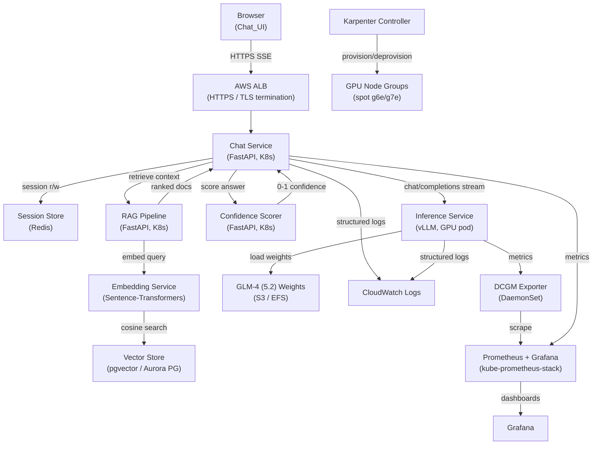

# Design Document — GLM Chat Application

## Overview

The GLM Chat Application is a publicly accessible web chat interface backed by a self-hosted GLM-4 (GLM 5.2) large language model. The system combines a React-based streaming frontend, a FastAPI chat API gateway, a RAG pipeline for answer grounding, a confidence scorer, and a vLLM-based inference service deployed on AWS EKS with cost-optimised spot GPU nodes.

Key design goals:
- **Anti-hallucination**: every answer is grounded through retrieval; low-confidence answers are refused rather than fabricated.
- **Spot resilience**: inference pods survive EC2 spot interruptions gracefully with a 90-second drain window and automatic fallback to on-demand capacity.
- **Elastic scaling**: GPU utilisation drives both horizontal pod scaling (HPA) and node provisioning (Karpenter) transparently.
- **Security by default**: no public surface for inference; mTLS inside the cluster; IRSA for all AWS access.

---

## Architecture



### Traffic Flow (happy path)

1. User submits a message in the browser → SSE connection opened to ALB.
2. ALB routes to **Chat Service**; session token validated, conversation history loaded from **Redis**.
3. Chat Service calls **RAG Pipeline**: query is embedded → cosine search against **pgvector** → top-k documents returned.
4. Chat Service builds the prompt (system prompt + retrieved docs + last 20 conversation turns) and streams to **vLLM Inference Service**.
5. Streamed tokens are forwarded to the browser via SSE as they arrive.
6. Once generation completes, Chat Service sends the full answer to the **Confidence Scorer**.
7. If confidence ≥ 0.7 the answer is committed to session history and the SSE stream ends with `[DONE]`; otherwise a refusal message is sent.

---

## Components and Interfaces

### Chat Service (API Gateway)

- **Runtime**: Python 3.12, FastAPI, Uvicorn
- **Kubernetes**: `Deployment`, 2–20 replicas, `HorizontalPodAutoscaler` on custom metric
- **Endpoints**:

| Method | Path | Description |
|--------|------|-------------|
| `POST` | `/chat` | Initiate or continue a conversation (accepts `session_id`, `message`); returns SSE stream |
| `GET`  | `/health` | Liveness probe |
| `GET`  | `/ready` | Readiness probe (checks Redis + RAG + Inference reachability) |

- **Session handling**: `session_id` is a UUID carried as an `HttpOnly; Secure; SameSite=Strict` cookie; sessions are stored in Redis with a 24-hour TTL.
- **Rate limiting**: token-bucket per source IP enforced with `slowapi`; limit 60 req/60 s → HTTP 429.
- **Streaming**: Chat Service proxies tokens from vLLM's SSE stream directly to the browser using `StreamingResponse`.

### RAG Pipeline Service

- **Runtime**: Python 3.12, FastAPI
- **Kubernetes**: `Deployment`, 2–6 replicas
- **Endpoints**:

| Method | Path | Description |
|--------|------|-------------|
| `POST` | `/retrieve` | Accept `{query: str, top_k: int, min_score: float}`, return ranked documents |

- **Embedding**: calls **Embedding Service** for vectorising the query.
- **Search**: cosine similarity via `pgvector` HNSW index; documents below `min_score` are filtered out.
- **Result**: returns `{documents: [...], grounding: "full"|"partial"|"none"}`.

### Embedding Service

- **Runtime**: Python 3.12, FastAPI, `sentence-transformers`
- **Model**: `BAAI/bge-m3` (multi-lingual, 1024-dim) — CPU pods, 2–4 replicas
- **Endpoint**: `POST /embed` → `{embedding: float[1024]}`

### Confidence Scorer

- **Runtime**: Python 3.12, FastAPI
- **Kubernetes**: `Deployment`, 2–4 replicas
- **Approach**: Cross-encoder reranker (`cross-encoder/ms-marco-MiniLM-L-6-v2`) scores the (query, generated-answer) pair; the output logit is sigmoid-normalised to `[0, 1]`.
- **Endpoint**: `POST /score` → `{score: float, threshold_met: bool}`
- **Fallback**: if the scorer pod is unavailable (circuit breaker open), the Chat Service treats score as `0.0` (below threshold) and returns the refusal message per requirement 3.8.

### Inference Service (vLLM)

- **Runtime**: vLLM ≥ 0.7, Python 3.12, CUDA 12
- **Model**: THUDM/glm-4-9b-chat (GLM 5.2 series); weights pre-downloaded to EFS at cluster bootstrap.
- **Kubernetes**: `Deployment`, GPU pods, resource request `nvidia.com/gpu: 1`
- **Endpoint**: OpenAI-compatible `POST /v1/chat/completions`
- **Streaming**: `stream: true` activates SSE token streaming; final event is `data: [DONE]`.
- **Configurable params per request**: `temperature` (0.0–2.0), `top_p` (0.0–1.0), `max_tokens` (1–8192), `system_prompt` (string)
- **Timeout**: 60 s; returns HTTP 504 on timeout (per requirement 4.5).
- **Out-of-range params**: HTTP 400 with descriptive error.

### Session Store (Redis)

- **Deployment**: Amazon ElastiCache for Redis (Cluster mode off, Multi-AZ replica), VPC-internal.
- **Schema**: `session:{session_id}` → JSON list of `{role, content}` capped at 100 entries (enforced by `LTRIM` after each `RPUSH`).

---

## Data Models

### HTTP Request: `POST /chat`

```json
{
  "session_id": "string (UUID)",
  "message": "string (1–4096 chars, non-whitespace-only)"
}
```

### HTTP Response: `POST /chat` (SSE stream)

Each SSE event follows the OpenAI streaming format:

```
data: {"id":"chatcmpl-abc","choices":[{"delta":{"content":"Hello"},"finish_reason":null}],"usage":null}
...
data: {"id":"chatcmpl-abc","choices":[{"delta":{},"finish_reason":"stop"}],"usage":{"prompt_tokens":120,"completion_tokens":55}}
data: [DONE]
```

Final event (non-streaming refusal):

```json
{
  "id": "chatcmpl-abc",
  "choices": [{"message": {"role": "assistant", "content": "I cannot confidently answer this question."}, "finish_reason": "stop"}],
  "metadata": {"grounding": "none", "confidence": 0.42, "sources": []}
}
```

### Response Metadata Object

```json
{
  "grounding": "full | partial | none",
  "confidence": 0.85,
  "sources": [
    {"doc_id": "uuid", "title": "string", "url": "string|null", "score": 0.91}
  ]
}
```

### Session Record (Redis)

```
Key: session:{session_id}   TTL: 86400s
Value: JSON array (max 100 elements):
[
  {"role": "user",      "content": "...", "ts": "2025-01-01T12:00:00Z"},
  {"role": "assistant", "content": "...", "ts": "2025-01-01T12:00:01Z"}
]
```

### RAG Document Schema (pgvector table)

```sql
CREATE TABLE documents (
  id          UUID PRIMARY KEY DEFAULT gen_random_uuid(),
  title       TEXT NOT NULL,
  url         TEXT,
  chunk_index INT  NOT NULL,
  content     TEXT NOT NULL,
  embedding   VECTOR(1024) NOT NULL,
  metadata    JSONB,
  created_at  TIMESTAMPTZ DEFAULT NOW()
);

CREATE INDEX ON documents USING hnsw (embedding vector_cosine_ops)
  WITH (m = 16, ef_construction = 64);
```

### `/retrieve` Request / Response

```json
// Request
{ "query": "string", "top_k": 5, "min_score": 0.65 }

// Response
{
  "documents": [
    { "doc_id": "uuid", "title": "...", "url": "...", "content": "...", "score": 0.91 }
  ],
  "grounding": "full"
}
```

### Inference Request (internal, to vLLM)

```json
{
  "model": "glm-4-9b-chat",
  "messages": [
    {"role": "system", "content": "You are a helpful assistant. Answer only from the provided context."},
    {"role": "user",   "content": "Context:\n...\n\nQuestion: ..."},
    {"role": "assistant", "content": "..."},
    ...
  ],
  "temperature": 0.7,
  "top_p": 0.9,
  "max_tokens": 1024,
  "stream": true
}
```

### Observability Log Entry (structured JSON)

```json
{
  "correlation_id": "uuid",
  "timestamp": "2025-01-01T12:00:00.123Z",
  "service": "chat-service",
  "level": "ERROR",
  "http_status": 500,
  "error_type": "InferenceTimeout",
  "request_tokens": 450,
  "latency_ms": 30012,
  "session_id_hash": "sha256:..."
}
```

Note: `message_content` is never logged; `session_id` is stored only as a SHA-256 hash.

---

## EKS Cluster Topology

### VPC Design

```
VPC (10.0.0.0/16)
├── Public subnets  (10.0.0.0/20, 10.0.16.0/20, 10.0.32.0/20)  — ALB, NAT GW
└── Private subnets (10.0.48.0/20, 10.0.64.0/20, 10.0.80.0/20) — EKS nodes, RDS, ElastiCache
```

Three Availability Zones in `us-east-1` (primary). A second region (`us-west-2`) is an optional warm-standby.

### Node Groups

| Node Group | Instance Types | Capacity Type | Purpose |
|-----------|---------------|--------------|---------|
| `system-od` | `m7i.2xlarge` | On-demand | Karpenter controller, CoreDNS, ALB controller, Prometheus, Grafana |
| `gpu-spot` | g6e.xlarge, g6e.2xlarge, g6e.4xlarge, g7e.xlarge, g7e.2xlarge, g7e.4xlarge | Spot | Inference Service pods |
| `cpu-spot` | c7i.2xlarge, c7i.4xlarge | Spot | Chat Service, RAG, Embedding, Scorer pods |

### Instance Specs Summary

| Family | GPU | GPU Memory / GPU | Notes |
|--------|-----|-----------------|-------|
| g6e | NVIDIA L40S | 48 GiB | xlarge=1 GPU, 2xlarge=1 GPU, 4xlarge=1 GPU |
| g7e | NVIDIA RTX PRO 6000 Blackwell | 96 GiB | xlarge=1 GPU, 2xlarge=1 GPU, 4xlarge=1 GPU |

GLM-4-9B in FP16 requires ~20 GiB GPU memory; a single `g6e.xlarge` (48 GiB) can run one inference pod with headroom for KV-cache.

### Karpenter NodePool Configuration

```yaml
# GPU NodePool (spot-first, on-demand fallback)
apiVersion: karpenter.sh/v1
kind: NodePool
metadata:
  name: gpu-inference
spec:
  disruption:
    consolidationPolicy: WhenEmpty
    consolidateAfter: 60s
    budgets:
    - nodes: "10%"   # at most 10% of GPU nodes disrupted simultaneously
  template:
    metadata:
      labels:
        workload: inference
    spec:
      nodeClassRef:
        group: karpenter.k8s.aws
        kind: EC2NodeClass
        name: gpu-nodes
      requirements:
      - key: karpenter.sh/capacity-type
        operator: In
        values: ["spot", "on-demand"]   # spot preferred; on-demand fallback
      - key: node.kubernetes.io/instance-type
        operator: In
        values:
        - g6e.xlarge
        - g6e.2xlarge
        - g6e.4xlarge
        - g7e.xlarge
        - g7e.2xlarge
        - g7e.4xlarge
      - key: karpenter.k8s.aws/instance-gpu-name
        operator: In
        values: ["l40s", "rtx-pro-6000"]
      taints:
      - key: nvidia.com/gpu
        effect: NoSchedule
  limits:
    nvidia.com/gpu: 20   # max 20 GPU pods = max cost cap (req 6.4)
```

```yaml
# EC2NodeClass
apiVersion: karpenter.k8s.aws/v1
kind: EC2NodeClass
metadata:
  name: gpu-nodes
spec:
  amiFamily: AL2023
  role: KarpenterNodeRole-glm-chat
  subnetSelectorTerms:
  - tags:
      karpenter.sh/discovery: glm-chat
  securityGroupSelectorTerms:
  - tags:
      karpenter.sh/discovery: glm-chat-gpu
  blockDeviceMappings:
  - deviceName: /dev/xvda
    ebs:
      volumeSize: 200Gi
      volumeType: gp3
  userData: |
    #!/bin/bash
    # NVIDIA driver + container toolkit bootstrap handled by AL2023 GPU AMI
```

**Spot-to-on-demand fallback logic**: Karpenter evaluates `spot` capacity first across all six instance types; if the spot market returns `InsufficientCapacityError` for all types for more than 5 minutes (requirement 5.5), it promotes the same NodePool request to `on-demand` with a minimum 24 GiB GPU requirement (satisfied by any g6e or g7e on-demand variant).

---

## Spot Interruption Handling

### Architecture

AWS Node Termination Handler (NTH) runs as a `DaemonSet` on all GPU nodes. It polls the EC2 instance metadata endpoint (`169.254.169.254/latest/meta-data/spot/instance-action`) every 5 seconds.

```
Spot ITN received (T=0)
  │
  ├─ NTH cordons node (T ≈ 2s)
  ├─ NTH drains node via pod eviction API (T ≈ 5s)
  │    └─ Inference pods receive SIGTERM
  │         ├─ vLLM preStop hook: drain in-flight requests (max 90s window)
  │         └─ Pod terminationGracePeriodSeconds: 100s
  └─ Node terminates (T ≈ 120s, AWS hard deadline)
```

### vLLM Pod Lifecycle

```yaml
terminationGracePeriodSeconds: 100
containers:
- name: vllm
  lifecycle:
    preStop:
      exec:
        command: ["/bin/sh", "-c", "kill -SIGTERM 1; sleep 90"]
  env:
  - name: VLLM_GRACEFUL_SHUTDOWN_TIMEOUT
    value: "90"
```

On SIGTERM, vLLM stops accepting new requests, completes in-flight generation up to the 90-second window, then exits. ALB health check (`/ready`) returns non-2xx immediately on SIGTERM receipt, so the load balancer stops routing new connections within one health-check interval (5 s).

### Karpenter Disruption Budget

The `budgets: [{nodes: "10%"}]` setting ensures Karpenter's own consolidation never evicts more than 10% of GPU nodes at once, preventing self-inflicted mass disruption distinct from spot interruptions (requirement 5.4 — the cordon/drain sequence is only triggered by ITN, not by Karpenter consolidation, which uses a controlled `terminatingPodDisruptionBudget` path).

### Non-Spot Termination

When Karpenter deprovisions a node for consolidation (not spot ITN), NTH does not trigger — Karpenter uses the Kubernetes pod eviction API directly and respects the pod's `PodDisruptionBudget`. The vLLM deployment has a `PodDisruptionBudget` with `minAvailable: 1`, guaranteeing at least one inference pod is always available.

---

## Auto-Scaling

### HPA Configuration

```yaml
apiVersion: autoscaling/v2
kind: HorizontalPodAutoscaler
metadata:
  name: inference-hpa
spec:
  scaleTargetRef:
    apiVersion: apps/v1
    kind: Deployment
    name: vllm-inference
  minReplicas: 1
  maxReplicas: 20
  metrics:
  - type: External
    external:
      metric:
        name: dcgm_fi_dev_gpu_util        # scraped via DCGM Exporter → Prometheus Adapter
        selector:
          matchLabels:
            workload: inference
      target:
        type: AverageValue
        averageValue: "70"               # 70% utilisation target
  behavior:
    scaleUp:
      stabilizationWindowSeconds: 60     # require 60s sustained >70% (req 6.2)
      policies:
      - type: Pods
        value: 4
        periodSeconds: 60
    scaleDown:
      stabilizationWindowSeconds: 300    # require 300s sustained <30% (req 6.3)
      policies:
      - type: Pods
        value: 1
        periodSeconds: 60
```

### Metrics Pipeline

```
NVIDIA GPU → DCGM Exporter (DaemonSet, port 9400)
         → Prometheus (scrape interval 30s)
         → prometheus-adapter (custom metrics API)
         → HPA controller
```

The `prometheus-adapter` is configured to expose `dcgm_fi_dev_gpu_util` as an external metric aggregated as an average across all `inference` pods.

### Scale-Up Node Provisioning

When the HPA increases replica count and no existing node has a free GPU slot, the scheduler marks the new pod as `Pending`. Karpenter observes the unschedulable pod and launches the cheapest available instance from the NodePool within ~30 seconds.

### Scale-Down Graceful Termination

When HPA decreases the replica count, Kubernetes issues a SIGTERM to the chosen pod. The `terminationGracePeriodSeconds: 120` window (requirement 6.6) allows in-flight generation to complete; pods forcefully terminated after 120 s if still running.

---

## Networking and Security

### ALB Ingress

```yaml
annotations:
  kubernetes.io/ingress.class: alb
  alb.ingress.kubernetes.io/scheme: internet-facing
  alb.ingress.kubernetes.io/certificate-arn: "arn:aws:acm:..."
  alb.ingress.kubernetes.io/ssl-policy: ELBSecurityPolicy-TLS13-1-2-2021-06
  alb.ingress.kubernetes.io/listen-ports: '[{"HTTPS":443},{"HTTP":80}]'
  alb.ingress.kubernetes.io/actions.redirect-http: >
    {"type":"redirect","redirectConfig":{"protocol":"HTTPS","statusCode":"HTTP_301"}}
```

TLS 1.2+ enforced; HTTP → HTTPS redirect for all traffic (requirement 8.1).

### Security Groups

| SG | Ingress | Egress |
|----|---------|--------|
| `sg-alb` | 0.0.0.0/0:443, 80 | VPC CIDR:8080 |
| `sg-chat-svc` | `sg-alb`:8080 | VPC CIDR (Redis, RAG, Scorer, vLLM) |
| `sg-inference` | `sg-chat-svc`:8000 (VPC-only) | S3 VPC endpoint, EFS |
| `sg-rds` | `sg-rag`:5432 | — |
| `sg-redis` | `sg-chat-svc`:6379 | — |

The inference service security group (`sg-inference`) has **no rule allowing ingress from outside the VPC** (requirement 8.3).

### IRSA (IAM Roles for Service Accounts)

Each Kubernetes service account is bound to a dedicated IAM role with minimal permissions:

| Service Account | IAM Actions |
|----------------|-------------|
| `chat-service` | `elasticache:Connect`, `logs:PutLogEvents`, `logs:CreateLogStream` |
| `rag-service` | `rds-db:connect` (specific DB resource ARN) |
| `inference-service` | `s3:GetObject` (weights bucket, specific prefix), `elasticfilesystem:ClientMount` |
| `karpenter` | EC2 fleet management actions (scoped to cluster tags) |

No wildcard actions (`*`) or wildcard resources (`*`) are used (requirement 8.2).

### VPC Endpoints

- S3 Gateway endpoint (weights download)
- ECR API + DKR interface endpoints (no NAT cost for image pulls)
- CloudWatch Logs interface endpoint
- STS interface endpoint (IRSA token exchange)

---

## Observability Stack

### Prometheus + Grafana

Deployed via `kube-prometheus-stack` Helm chart into the `monitoring` namespace on the `system-od` node group.

**Scrape targets** (60 s interval):
- `chat-service`: custom metrics (request rate, latency histograms, error rate, session count)
- `rag-service`: retrieval latency, no-document rate
- `vllm-inference`: `/metrics` endpoint (token throughput, queue depth, generation latency)
- `dcgm-exporter`: GPU utilisation, GPU memory used/free, SM clock, temperature
- `kube-state-metrics`: pod states, HPA status

**Grafana Dashboards**:
1. Inference Overview — TTFT p50/p95/p99, token throughput, GPU util, queue depth
2. RAG Health — retrieval latency, similarity score distribution, no-context rate
3. Cluster Topology — Karpenter node inventory, spot vs on-demand breakdown, cost estimate
4. SLO Dashboard — error rate, availability, p99 latency vs targets

### CloudWatch Log Export

Fluent Bit DaemonSet forwards all pod logs (JSON structured) to CloudWatch Log Groups:
- `/glm-chat/chat-service`
- `/glm-chat/inference-service`
- `/glm-chat/rag-service`

Retention: 30 days (requirement 9.4). Log entries never include message content or PII (requirement 9.3).

### Alerting

Prometheus Alertmanager routes to SNS → PagerDuty/email. Alert delivery within 120 s of threshold crossing (requirement 9.5). Retry logic: 3 retries with exponential backoff on SNS publish failure; each failure is logged to CloudWatch (requirement 9.6).

Sample alert rules:

```yaml
- alert: HighGPUUtilization
  expr: avg(dcgm_fi_dev_gpu_util{workload="inference"}) > 85
  for: 60s
  annotations:
    summary: "GPU utilisation above 85% for 60s"

- alert: InferenceErrorRate
  expr: rate(http_requests_total{service="inference",status=~"5.."}[5m]) /
        rate(http_requests_total{service="inference"}[5m]) > 0.05
  for: 60s

- alert: ConfidenceScorerDown
  expr: up{job="confidence-scorer"} == 0
  for: 30s
```

---

## Deployment Pipeline

### Container Images

Each service has its own `Dockerfile` based on minimal base images:

| Image | Base | Notes |
|-------|------|-------|
| `chat-service` | `python:3.12-slim` | No GPU dependency |
| `rag-service` | `python:3.12-slim` | |
| `embedding-service` | `python:3.12-slim` | sentence-transformers, ONNX runtime |
| `confidence-scorer` | `python:3.12-slim` | cross-encoder model |
| `inference-service` | `vllm/vllm-openai:latest` | CUDA 12, pinned digest |

All images are pushed to Amazon ECR with immutable tags (`SHA digest`). Images are scanned by ECR on push; critical CVEs block deployment.

### Helm Charts

Repository layout:
```
helm/
├── chat-service/
├── inference-service/
├── rag-service/
├── embedding-service/
├── confidence-scorer/
└── glm-chat-infra/        # umbrella chart (Karpenter NodePool, IRSA, SGs)
```

Each chart is parameterised by environment (`dev`, `staging`, `prod`) via `values-{env}.yaml`.

### CI/CD Outline

```
PR merge → GitHub Actions
  1. Build + test (unit + property tests) — all services
  2. Docker build + push to ECR (tagged with git SHA)
  3. Helm lint + dry-run against staging kubeconfig
  4. Deploy to staging (helm upgrade --atomic)
  5. Smoke tests (chat endpoint, /health, /ready)
  6. Manual gate for production
  7. Deploy to prod (helm upgrade --atomic --timeout 10m)
  8. Post-deploy verification (Prometheus query: error rate < 1%)
```

---

## Error Handling

### Chat Service

| Condition | Behaviour |
|-----------|-----------|
| RAG pipeline timeout (5 s) | Proceed without context; set `grounding: "none"` |
| Inference Service timeout (30 s) | Return HTTP 504; Chat_UI shows error + retry |
| Inference Service 5xx | Retry up to 3× with exponential backoff (1s, 2s, 4s); total ≤ 10s |
| Confidence Scorer unavailable | Treat confidence as 0.0; return refusal message |
| Redis unavailable | Serve request without session history (stateless fallback); log warning |
| Rate limit exceeded | Return HTTP 429 |

### Inference Service

| Condition | Behaviour |
|-----------|-----------|
| Out-of-range parameter | HTTP 400, descriptive message |
| Unrecognised parameter | HTTP 400, identifies offending parameter |
| Generation timeout (60 s) | Cancel request, HTTP 504 |
| Pod SIGTERM | Stop accepting new requests; complete in-flight within 90 s |

### Load Balancer

ALB health checks every 5 seconds (`/ready`); unhealthy pods deregistered within one failed check. New requests never routed to a pod that has already received SIGTERM.

---

